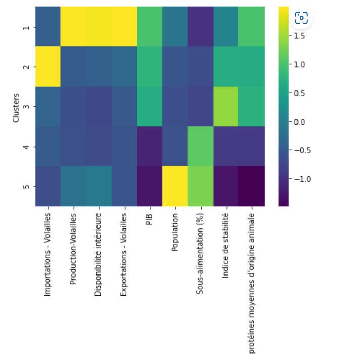

# Etude de marché avec Machine learning et KMeans

Un modèl non supervisé (KMeans) implémenté avec Python et Sklearn pour proposer des groupes des pays en tenant en compte plusieurs paramètres pour une entreprise internationale d'agroalimentaire.**.

## Préparation et transformation des données

Determiner les indicateurs à consider pour collecter et nettoyer les données depuis [FAOSTAT](https://www.fao.org/faostat/en/) et [World bank open data](https://donnees.banquemondiale.org/).

- Indicateurs economiques
- Indicateurs socio-economique
- Indicateurs relié à la disponibilité des aliments
- Indicateur de stabilité politique

## Exploration des données

Utiliser un PCA (Principal Component Analysis) pour explorer et comprendre les données.

 Modèl **PCA** avec sklearn.

## Clustering

Utiliser la carte de chaleur pour segmenter les groupes des pays.

## Modele KMeans avec sklearn

